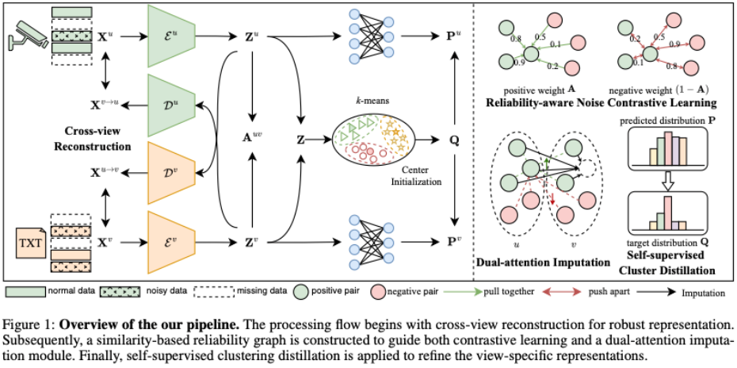
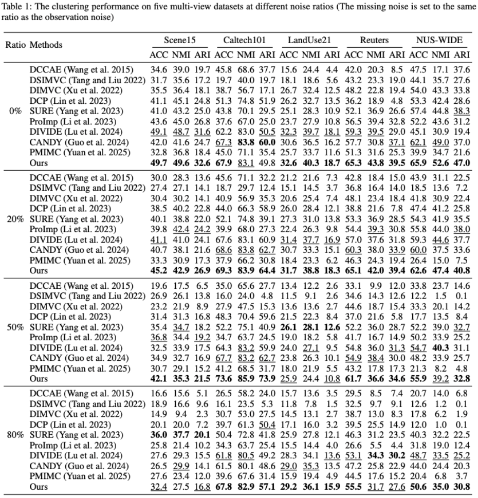

# RAC-DMVC: Reliability-Aware Contrastive Deep Multi-View Clustering under Multi-Source Noise
## Abstract
Multi-view clustering (MVC), which aims to separate the multi-view data into distinct clusters in an unsupervised manner, is a fundamental yet challenging task. To enhance its applicability in real-world scenarios, this paper addresses a more challenging task: MVC under multi-source noises, including missing noise and observation noise. To this end, we propose a novel framework, Reliability-Aware Contrastive Deep Multi-View Clustering (RAC-DMVC), which constructs a reliability graph to guide robust representation learning under noisy environments. Specifically, to address observation noise, we introduce a cross-view reconstruction to enhances robustness at the data level, and a reliability-aware noise contrastive learning to mitigates bias in positive and negative pairs selection caused by noisy representations. To handle missing noise, we design a dual-attention imputation to capture shared information across views while preserving view-specific features. In addition, a self-supervised cluster distillation module further refines the learned representations and improves the clustering performance. Extensive experiments on five benchmark datasets demonstrate that RAC-DMVC outperforms SOTA methods on multiple evaluation metrics and maintains excellent performance under varying ratios of noise.
## Pipline

## Experiments
```python
python main_train.py --config_file config/Scene15.yaml
```
## Main Results

## Cite
If you find the code useful in your research, please consider citing our paper:
```
@inproceedings{DBLP:conf/AAAI/DongAAAI26,
      title={RAC-DMVC: Reliability-Aware Contrastive Deep Multi-View Clustering under Multi-Source Noise}, 
      author={Shihao Dong and Yue Liu and Xiaotong Zhou and Yuhui Zheng and Huiying Xu and Xinzhong Zhu},
      booktitle={Proceedings of the AAAI Conference on Artificial Intelligence},
      year={2026}
}
```
